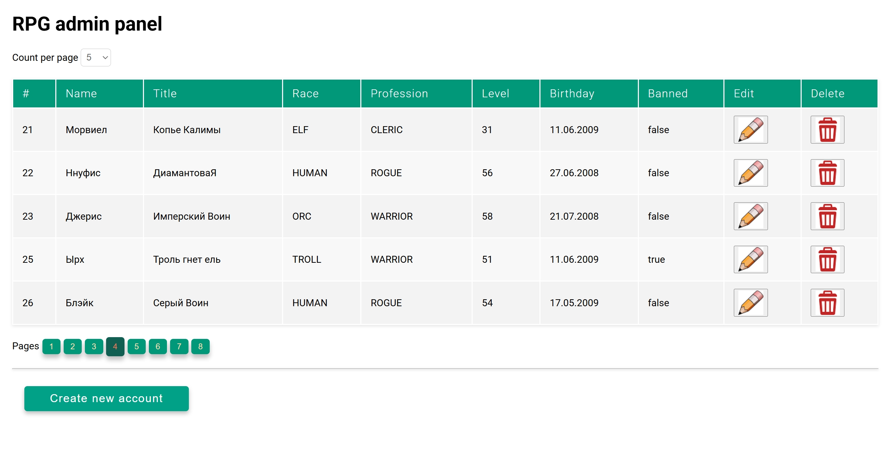
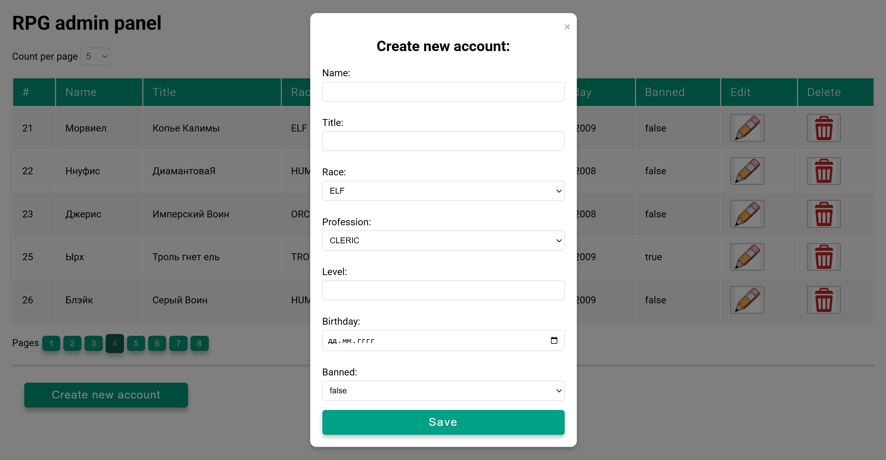

# RPG Admin Panel

This project is a simple web application for managing RPG character data. It allows you to view, create, edit, and delete character entries through a user-friendly interface.

## The application looks like this:

*   **Main page :**
*   **Modal window :**

## Features

*   **Displaying Characters:** Shows a table of RPG characters with details like ID, name, title, race, profession, level, birthday, and banned status.
*   **Pagination:** Implements pagination to handle large datasets, allowing users to navigate through character entries.
*   **Filtering by Page Size:** Allows users to select the number of characters displayed per page (3, 5, 10, or 20).
*   **Creating Characters:**  Provides a modal form for creating new character entries.
*   **Editing Characters:**  Enables in-place editing of existing character data within the table.
*   **Deleting Characters:**  Allows users to delete character entries.
*   **Banning/Unbanning Characters:**  Provides the ability to change the banned status of characters.

## Technologies Used

*   **HTML:**  For structuring the web page.
*   **CSS:** For styling the page (linked via `/css/my.css`).
*   **JavaScript:**  For handling dynamic behavior and interactions.
*   **jQuery:**  A JavaScript library used for simplifying DOM manipulation and AJAX requests.
*   **REST API:**  Interacts with a backend REST API (`/rest/players`) to fetch, create, update, and delete character data.
*   **Fonts:** Uses Google Fonts (Roboto) for improved typography.

## Setup and Installation

1.  **Clone the Repository:**
    ```bash
    git clone <repository_url>
    cd <repository_directory>
    ```

2.  **Backend Setup:**  This project relies on a backend REST API.  Make sure the backend is running and accessible. The API endpoints used are:
    *   `/rest/players`:  For fetching, creating, and updating character data.
    *   `/rest/players/count`: For getting the total count of players.
3.  **CSS Styling:**  Ensure that the `/css/my.css` file is correctly placed within the `css` directory and contains the necessary styles for the application.  Example if my.css contains:
    ```css
    body {
        font-family: "Roboto", serif;
        margin: 20px;
    }
    
    #count_pages {
        padding: 5px;
        font-size: 15px;
        color: #696969;
        border: 1px solid rgb(201 201 201);
        border-radius: 5px;
        outline: none;
    }
    
    table {
        width: 100%;
        margin: 20px 0;
        font-size: 16px;
        text-align: left;
        box-shadow: 0 2px 5px rgba(0, 0, 0, 0.1);
    }
    
    th, td {
        padding: 12px 15px;
    }
    
    th {
        background-color: #009879;
        color: #ffffff;
        font-size: 18px;
        font-weight: 300;
        letter-spacing: 0.06em;
    }
    
    tr {
        border-bottom: 1px solid #dddddd;
    }
    /* Add more styles here */
    ```

4.  **Image Directory:**  Create an `img` directory and place the `edit.png` and `delete.png` images used for edit and delete buttons in it. Example:
    ```bash
    mkdir img
    # Place edit.png and delete.png inside the img folder
    ```

5.  **Open in Browser:**  Open the `index.html` file in your web browser.

## Usage

1.  **Viewing Characters:** The character table will load automatically when the page is opened. You can change the number of characters displayed per page using the "Count per page" dropdown.
2.  **Navigating Pages:** Use the page number buttons below the table to navigate between different pages of character entries. The currently active page will be highlighted.
3.  **Creating a New Character:** Click the "Create new account" button to open the modal form. Fill in the character details and click "Save" to create the new character.
4.  **Editing a Character:** Click the edit icon (pencil) in the "Edit" column of the row you want to edit. The row will transform into an editable form.  Make your changes and click the save icon (floppy disk) to save them.
5.  **Deleting a Character:** Click the delete icon (trash can) in the "Delete" column of the row you want to delete. The character entry will be removed.

## JavaScript Functions

*   `showTable(pageNumber)`: Fetches character data from the REST API and populates the table.  Handles pagination and active page highlighting.
*   `getTotalCount()`: Retrieves the total count of characters from the REST API.
*   `getCurrentPage()`: Determines the currently active page number.
*   `deleteAccount(id)`: Deletes a character with the given ID via the REST API.
*   `editAccount(id)`: Transforms a table row into an editable form for the character with the given ID.
*   `saveAccount(id)`: Saves the updated character data to the REST API.
*   `createAccount()`: Creates a new character entry via the REST API.
*   `getDropdownRaceHtml(id)`, `getDropdownProfessionHtml(id)`, `getDropdownBannedHtml(id)`: Helper functions for generating the HTML for the dropdown select elements in the edit mode.

##  Notes

*   **Error Handling:** The code lacks robust error handling.  Consider adding error handling for AJAX requests and form validation.
*   **Security:** This is a client-side application.  All security measures should be implemented in the backend API.
*   **CSS Styling:** The application relies on an external CSS file (`/css/my.css`). You may need to modify it to adjust the appearance to your preferences.
*   **Dependencies:** Requires jQuery.  The project links to a CDN for jQuery.

## Contributing

Contributions are welcome! Please fork the repository, make your changes, and submit a pull request.
